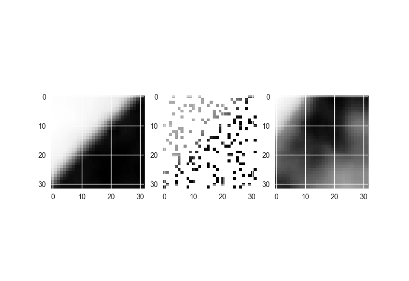
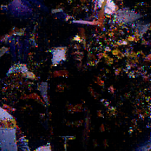

# Image restoration

this is a programme image restoration.(or more specifically missing pixel inpainting)

the purpose is to revover images from its noises.

mainly implement two approach.

1. First is used pixels inside a window to online learn image feature.

2. Using Generative Adversial Network to train a Generative model

## Approach 1

Using gaussian process regression.

  

## Approach 2

Using a GAN method, the generative model structure is like the paper **Can fully convolutional networks perform well for general image restoration problems?**. And the discriminitor is although a conv nn which judges if it is a generated iamge or a new image

  

Not that the parameter tuning on GAN nn is rather hard. You will need to first train the discriminitor and the updates on discriminitor should also be slower(less epoches)

  
  
  

  

  

As test and comparison, the left is the result of using a gaussian process regressor, and the right is the result of the generative network.(**note** : the GAN is not trained throughly, there is still potential improvement, the training can still go on)
