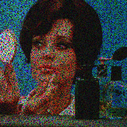
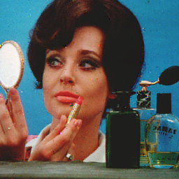

# Image restoration

this is a programme used for image restoration.

the purpose is to revover images from its noises.

mainly implement two approach.

1. First is used pixels inside a window to online learn image feature.

2. Using Generative Adversial Network to train a Generative model

## Approach 1

Using gaussian process regression.

## Approach 2

Using a GAN method, the generative model structure is like the paper **Can fully convolutional networks perform well for general image restoration problems?**. And the discriminitor is although a conv nn which judges if it is a generated iamge or a new image

# REFERENCE

[1] <https://arxiv.org/pdf/1611.04481.pdf>
